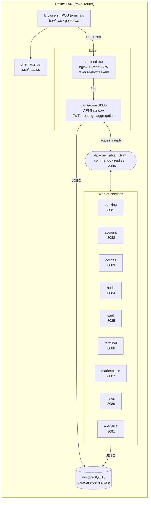
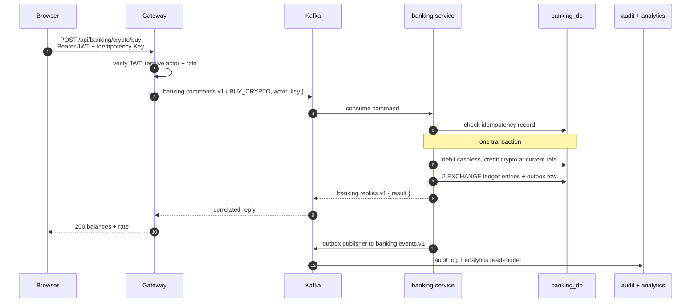

# Cyberpunk Economy

**An event-driven microservice platform that ran a live in-person economy game for ~70 players — fully offline, on consumer laptops.**

[](https://github.com/Andrew97422/cyberpunk-economy/actions/workflows/ci.yml)
[](https://openjdk.org/projects/jdk/17/)
[](https://spring.io/projects/spring-boot)
[](https://kafka.apache.org/)
[](https://www.postgresql.org/)
[](https://react.dev/)
[](https://www.typescriptlang.org/)
[](https://docs.docker.com/compose/)
[](LICENSE)

> 🇷🇺 [Читать по-русски](README.ru.md) · 📐 [Architecture](docs/ARCHITECTURE.md) · 🔐 [Security](docs/SECURITY.md) · 📬 [Event catalog](main-server/docs/event-catalog.md)

---

## What this is

Players in a live-action roleplaying game get bank accounts, physical payment cards and POS
terminals. They transfer money, trade a cryptocurrency whose rate moves on its own, buy goods
in a shop with scheduled price scenarios, and read an in-game news feed. Bankers and admins run
the economy from a back office; every action lands in an audit log and an analytics read-model.

Behind it sits a **ten-service, event-driven Spring Boot backend**: an API gateway that speaks
HTTP to the browser and **Kafka request/reply** to workers, database-per-service isolation, a
transactional **outbox** for reliable event publication, and **idempotency keys** on every
money-moving operation.

The hard constraint that shaped every decision: **it had to run with no internet, on two or
three ordinary laptops behind a travel router, operated by non-engineers.** That is why there is
a local DNS service, PowerShell runbooks, memory-capped JVMs, image export/import scripts, and a
printed failure playbook.

It ran. The game was played end to end by ~70 participants across two days.

## At a glance

| | |
|---|---|
| **Backend services** | 10 Spring Boot apps (1 gateway + 9 workers) |
| **Java** | ~15,500 LOC across 342 files |
| **Frontend** | React 18 + TypeScript SPA, 35 pages, ~7,700 LOC |
| **Gateway REST API** | 86 endpoints, OpenAPI/Swagger generated |
| **Kafka** | 19 topics, 77 typed command types, request/reply + domain events |
| **Persistence** | 10 databases, 49 JPA entities, 36 tables, 28 Flyway migrations |
| **Integration tests** | 139 assertions in a dependency-free E2E runner |
| **Deployment** | 3 Compose topologies (single-host / 3-machine split), 15 containers |

## Architecture



### Request lifecycle — buying crypto



## Engineering highlights

**Kafka request/reply behind a REST façade.**
`KafkaCommandGateway` turns an HTTP call into a correlated command on a per-service topic and
blocks on the reply topic with a timeout, mapping downstream failures back to real HTTP status
codes. Workers never expose HTTP to clients — the gateway is the only front door, so the SPA is
always same-origin and exactly one place understands authentication.
→ [`KafkaCommandGateway.java`](main-server/src/main/java/ru/andrew/mainserver/gateway/core/KafkaCommandGateway.java)

**Transactional outbox instead of two-phase commit.**
State changes and their events are written in the same database transaction; a publisher drains
`outbox_events` into Kafka asynchronously. No dual-write, no lost events, no distributed
transaction coordinator.
→ [`OutboxPublisher.java`](main-server/banking-service/src/main/java/ru/andrew/bankingservice/service/OutboxPublisher.java)
· [`V3__create_outbox_events.sql`](main-server/banking-service/src/main/resources/db/migration/V3__create_outbox_events.sql)

**Idempotency on every money-moving command.**
A key plus a request fingerprint is persisted before the operation. A retried request replays
the stored result; a *different* payload under the same key is rejected. Retries at the network
edge cannot double-charge a player.
→ [`IdempotencyService.java`](main-server/banking-service/src/main/java/ru/andrew/bankingservice/service/IdempotencyService.java)

**Database-per-service with snapshot replication.**
Each service owns its schema and no service reads another's tables. The identity data that
banking, access and card genuinely need (`publicName`, role, status) is replicated locally into
an `account_snapshot` table, kept current by consuming account events. Eventual consistency is
explicit and bounded instead of hidden behind a join.

**The crypto market as a physical law.**
The exchange rate is a discrete mean-reverting stochastic process, not a scripted curve:

```
logReturn = drift + k·ln(baseline / rate) + volatility·Z ,   Z ~ N(0,1)
rate'     = clamp(rate · e^logReturn, [min, max])
```

`drift` is the admin's directional pressure (pump/dump as a *political* lever), shocks apply an
instant multiplier, and `k` pulls the price home so the market cannot run away during a
multi-hour game. Every tick is persisted to `crypto_tick`, which is what makes the trading
charts real rather than decorative.
→ [`CryptoMarketService.java`](main-server/banking-service/src/main/java/ru/andrew/bankingservice/service/CryptoMarketService.java)

**Schema as code.** `ddl-auto: validate` everywhere — Flyway migrations are the only thing that
may change a schema, so a service refuses to start against a database it does not recognise.

**Operations designed for non-engineers.** A 13-document runbook in [`ИНСТРУКЦИЯ/`](ИНСТРУКЦИЯ/)
covers network setup, finding your IP, moving Docker images to an offline machine, the failure
playbook and power management — plus PowerShell tooling in [`deploy/balancer/`](deploy/balancer/)
for start/health/backup/restore/reset and RAM-aware service placement across laptops.

## Tech stack

| Layer | Choice |
|---|---|
| **Language / runtime** | Java 17, TypeScript 5.6, Node 18+ |
| **Backend** | Spring Boot 3.5 — Web, Data JPA, Security, Validation, Actuator |
| **Messaging** | Apache Kafka (KRaft, single broker), `ReplyingKafkaTemplate` |
| **Persistence** | PostgreSQL 16, Hibernate, Flyway |
| **Auth** | JWT (JJWT 0.12), BCrypt, method-level `@PreAuthorize`, PIN sessions for terminals |
| **API docs** | springdoc-openapi (Swagger UI per service) |
| **Frontend** | React 18, React Router 6, Vite 5, Axios, `marked` + DOMPurify |
| **Infrastructure** | Docker Compose, nginx, dnsmasq, PowerShell runbooks |

## Quick start

**Requirements:** Docker Desktop (or Docker Engine + Compose v2). Nothing else — the JVM and
Node toolchains live inside the build images.

```bash
git clone https://github.com/Andrew97422/cyberpunk-economy.git
cd cyberpunk-economy

cp .env.example .env
# Fill in real values — compose fails closed if any secret is missing:
#   openssl rand -base64 48   -> APP_JWT_SECRET   (must be valid Base64)
#   openssl rand -hex 24      -> DB_PASSWORD
#   openssl rand -hex 12      -> BOOTSTRAP_ADMIN_PASSWORD

docker compose up -d --build
```

| Where | URL |
|---|---|
| Game / bank UI | `http://localhost` |
| Gateway API | `http://localhost:8080/api` |
| Swagger UI | `http://localhost:8080/api/docs` |
| Health | `http://localhost:8080/api/actuator/health` |
| Kafka UI *(opt-in profile)* | `http://localhost:8090` |

Sign in with `BOOTSTRAP_ADMIN_NAME` / `BOOTSTRAP_ADMIN_PASSWORD` from your `.env`.
On Windows, `СТАРТ.cmd` wraps the whole thing for on-site operators.

**Multi-machine (3 laptops):** use `.env.multi.example` and the split topologies
`compose.core.yaml` + `compose.finance.yaml` + `compose.rest.yaml`.
See [DEPLOY-MULTI.md](DEPLOY-MULTI.md).

## Testing

```bash
# Integration suite — 139 assertions against a running stack, zero dependencies
node e2e/seed.mjs            # optional: seed demo accounts, products, news
node e2e/run-scenarios.mjs   # BASE=... ADMIN_NAME=... ADMIN_PASSWORD=... to override
```

The runner exercises auth, accounts, PINs, banking (admin and player context), sessions and
audit through the real gateway, including the asynchronous account-to-banking propagation (it
retries until the Kafka-driven snapshot lands). The expected status code for every case is
documented in [`e2e/SCENARIOS.md`](e2e/SCENARIOS.md).

> **Honest gap:** JVM-level unit coverage is thin — the suite above carries the correctness
> guarantees today. Growing unit tests around the banking domain is the top item on the
> [roadmap](#roadmap).

## Repository layout

```
.
├── main-server/              # 10 Maven projects: gateway + 9 worker services
│   ├── src/                  #   game-core — API gateway (JWT, routing, aggregation)
│   ├── banking-service/      #   balances, ledger, crypto exchange, credit, outbox
│   ├── account-service/      #   accounts, roles, statuses, admin bootstrap
│   ├── access-service/       #   PIN codes and game sessions
│   ├── card-service/         #   physical card to account bindings
│   ├── terminal-service/     #   POS terminals
│   ├── marketplace-service/  #   products, orders, scheduled price scenarios
│   ├── news-service/         #   in-game news feed
│   ├── audit-service/        #   audit log + hack-token feature
│   ├── analytics-service/    #   read-model over events
│   └── docs/event-catalog.md #   versioned event contracts
├── frontend/                 # React 18 + TS SPA (feature-sliced), nginx image
├── e2e/                      # dependency-free integration runner + scenario catalog
├── deploy/                   # PowerShell ops tooling, Postgres init, resource limits
├── docs/                     # architecture, security, game design
├── ИНСТРУКЦИЯ/               # 13-part on-site runbook (Russian, for operators)
├── docker-compose.yaml       # single-host topology
└── compose.{core,finance,rest}.yaml   # 3-machine split topology
```

## Security

Secrets live only in `.env`, which is git-ignored; Compose declares them with `${VAR:?}` so the
stack **fails closed** rather than starting on a weak default. Auth is JWT at the gateway with
`@PreAuthorize` on the endpoints, plus separate PIN-backed sessions for terminals.

The known hardening backlog — unexposed service ports, Swagger/Actuator lockdown, a real secret
manager, TLS — is tracked openly in [docs/SECURITY.md](docs/SECURITY.md).

Real gameplay data (participant names, balances, transactions) is **deliberately excluded** from
this repository and ignored by `.gitignore`.

## Known limitations

This is an MVP that was built to a date, and it is documented as one rather than dressed up:

- **Single points of failure** — one Postgres, one Kafka broker (RF=1). Failover between laptops
  is a documented manual procedure.
- **Network surface** — worker ports and Postgres are published to the host, which was
  acceptable on an isolated LAN and is wrong for anything else.
- **Observability** — audit, analytics and Actuator metrics exist, but there is no centralised
  log/metric collection.
- **Unit test coverage** — see [Testing](#testing).

## Roadmap

- **Phase 0 — foundation:** unit tests around the banking domain, image registry, secrets in a
  manager, automated backup/restore, baseline observability.
- **Phase 1 — scale at the event:** Compose to **k3s** for self-healing, rolling updates and
  stateless replicas; warm-standby Postgres.
- **Phase 2 — product:** cloud control plane (tenants, licensing, telemetry), edge appliance with
  GitOps, multi-tenancy.

Full reasoning in [docs/ARCHITECTURE.md](docs/ARCHITECTURE.md).

## License

[MIT](LICENSE) © Andrew Nosov
