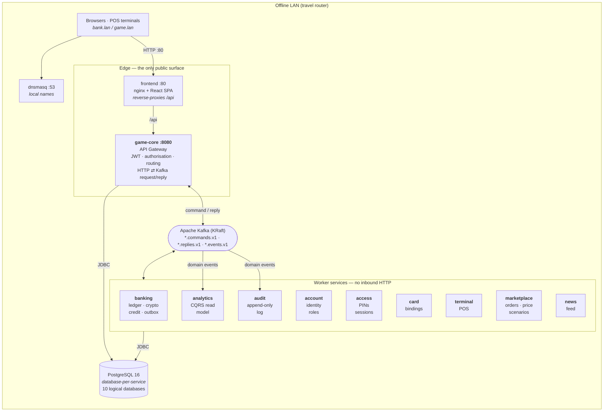
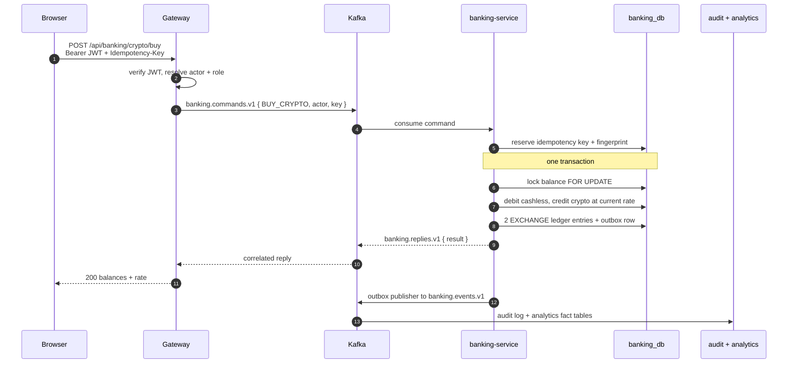

# Cyberpunk Economy

**A ten-service, event-driven Spring Boot backend that ran a live economy game for ~70 players — Kafka request/reply behind an API gateway, database-per-service, transactional outbox, idempotent money operations. Fully offline, on consumer laptops.**

[](https://github.com/Andrew97422/cyberpunk-economy/actions/workflows/ci.yml)
[](https://github.com/Andrew97422/cyberpunk-economy/actions/workflows/e2e.yml)
[](https://openjdk.org/projects/jdk/17/)
[](https://spring.io/projects/spring-boot)
[](https://kafka.apache.org/)
[](https://www.postgresql.org/)
[](https://flywaydb.org/)
[](https://docs.docker.com/compose/)
[](LICENSE)

> 🇷🇺 [Читать по-русски](README.ru.md) · 📐 [Architecture](docs/ARCHITECTURE.md) · 🔐 [Security](docs/SECURITY.md) · 📬 [Event catalog](main-server/docs/event-catalog.md) · 🧪 [Scenario catalog](e2e/SCENARIOS.md)

---

## What this is

A live-action roleplaying game needs a working economy: bank accounts, physical payment cards,
POS terminals, a cryptocurrency with a rate that moves on its own, a central bank that sets a key
rate, a shop whose prices follow scheduled scenarios, a news feed, an audit trail. This is the
system that ran it.

The interesting part is not the game. It is that **the backend had to behave like a payment
system** — no double charges on a retry, no lost events, no torn transfers under concurrency —
while running **with no internet, on two or three ordinary laptops behind a travel router,
operated by people who are not engineers.**

It ran. ~70 participants played it end to end across two days.

## At a glance

| | |
|---|---|
| **Backend** | 10 independent Spring Boot services · ~15,500 LOC across 342 Java files |
| **API gateway** | 86 REST endpoints, OpenAPI-generated, the only process exposed to clients |
| **Messaging** | Apache Kafka (KRaft) · 26 topics (9 command/reply pairs + 8 event streams) · 78 typed commands |
| **Persistence** | 10 databases · 49 JPA entities · 36 tables · 28 Flyway migrations · schema-as-code |
| **Consistency** | Transactional outbox · idempotency keys · ordered pessimistic locks · CQRS read model |
| **Integration tests** | 138 assertions against a live stack, zero test dependencies |
| **Deployment** | 3 Compose topologies (single host / 3-machine split) · 15 containers |
| **Frontend** | React 18 + TypeScript SPA, 35 pages (thin client over the gateway) |

## Architecture

Every client talks to **one** process. The gateway authenticates, then translates HTTP into
correlated Kafka commands; worker services never expose HTTP to the outside.



### Services and the data they own

No service reads another service's tables. Ever.

| Service | Port | Owns | Notable mechanics |
|---|---|---|---|
| **game-core** *(gateway)* | 8080 | `accounts` + `session_snapshot` read-models, `outbox_events` | JWT, `@PreAuthorize`, HTTP⇄Kafka correlation, response aggregation |
| **banking** | 8081 | `balances`, `bank_transactions`, `crypto_market_state`, `crypto_tick`, `deposits`, `loans`, `credit_policy`, `idempotency_records`, `outbox_events` | Paired-entry ledger with running balances, stochastic crypto market, key-rate credit model, idempotency, outbox |
| **account** | 8082 | `accounts` | Identity, roles, statuses, admin bootstrap, publishes `account.events` |
| **access** | 8083 | `pin_codes`, `game_sessions` | PIN issuance and terminal sessions |
| **audit** | 8084 | `audit_logs` | Append-only event trail, hack-token feature |
| **card** | 8085 | `card_bindings` | Physical card ⇄ account binding |
| **terminal** | 8086 | `terminals` | POS registration and routing |
| **marketplace** | 8087 | `products`, `market_orders`, `scenarios`, `scenario_schedules`, `pending_steps` | Durable DB-backed scheduler for price scenarios |
| **news** | 8089 | `news_posts` | Feed with media upload |
| **analytics** | 8091 | `account_fact`, `money_flow`, `order_fact` | CQRS read model built from domain events |

## Backend engineering

### The gateway is the only front door

`KafkaCommandGateway` turns an authenticated HTTP call into a correlated `ServiceCommand` on a
per-service commands topic and blocks on the replies topic with a timeout. One generic helper is
instantiated once per downstream service, so adding a service is configuration rather than code.

The subtle part is **error fidelity across an async boundary**. A worker cannot throw an HTTP
exception at the caller, so each command listener catches its domain exceptions and encodes the
intended status into the reply envelope:

```java
try {
    reply = dispatch(command, type);
} catch (BadRequestException ex) {   reply = ServiceReply.error(400, ex.getMessage()); }
catch (NotFoundException ex)     {   reply = ServiceReply.error(404, ex.getMessage()); }
catch (Exception ex)             {   reply = ServiceReply.error(500, "Internal error: …"); }
```

The gateway unwraps it and rethrows a real `ResponseStatusException`, so a client sees `400` for
insufficient funds and `404` for a missing account — exactly as if the call had been synchronous.
The full expected mapping is pinned down in [`e2e/SCENARIOS.md`](e2e/SCENARIOS.md).

→ [`KafkaCommandGateway.java`](main-server/src/main/java/ru/andrew/mainserver/gateway/core/KafkaCommandGateway.java)
· [`BankingCommandListener.java`](main-server/banking-service/src/main/java/ru/andrew/bankingservice/listener/BankingCommandListener.java)

### Money correctness

**Idempotency with a request fingerprint.** Every money-moving command persists
`(key, SHA-256(operation|actorId|payload))` *before* doing the work. A retry with the same key
replays the stored response; the same key with a *different* payload is rejected outright rather
than silently doing the wrong thing. Network retries at the edge cannot double-charge a player.
→ [`IdempotencyService.java`](main-server/banking-service/src/main/java/ru/andrew/bankingservice/service/IdempotencyService.java)

**A ledger, not a balance column.** Every operation writes paired entries — `TRANSFER_OUT` and
`TRANSFER_IN`, or two `EXCHANGE` rows for a crypto trade — each carrying `balance_before` and
`balance_after` for its account. Rejected attempts are persisted too, with status `REJECTED`, so an
insufficient-funds attempt leaves an audit trail instead of vanishing. Any account's history
reconstructs from its own rows, and reversals are entries (`REVERSAL_IN`/`REVERSAL_OUT`) rather
than deletions — the ledger is append-only in practice.

**Deadlock-free transfers.** A transfer locks two rows. Locking them in the order they arrive is
how you get a deadlock the first time two players pay each other simultaneously, so the locks are
always taken in a deterministic order:

```java
Long firstId  = Math.min(from.getId(), to.getId());
Long secondId = Math.max(from.getId(), to.getId());

Balance firstLocked  = getBalanceForUpdate(firstId);   // SELECT … FOR UPDATE
Balance secondLocked = getBalanceForUpdate(secondId);
```

→ [`BankingServiceImpl.java`](main-server/banking-service/src/main/java/ru/andrew/bankingservice/service/BankingServiceImpl.java)
· [`BalanceRepository.java`](main-server/banking-service/src/main/java/ru/andrew/bankingservice/repository/BalanceRepository.java)

**Transactional outbox instead of two-phase commit.** The state change and its event are written
in the same database transaction; a publisher drains `outbox_events` every 3s in batches, keyed by
aggregate id so per-account event order is preserved on the partition. No dual-write, no lost
events, no distributed transaction coordinator.
→ [`OutboxPublisher.java`](main-server/banking-service/src/main/java/ru/andrew/bankingservice/service/OutboxPublisher.java)
· [`V3__create_outbox_events.sql`](main-server/banking-service/src/main/resources/db/migration/V3__create_outbox_events.sql)

**Producers configured for durability.** `acks=all` plus `enable.idempotence=true` on every
producer, so a broker-side retry cannot silently duplicate an event.
→ [`KafkaConfig.java`](main-server/banking-service/src/main/java/ru/andrew/bankingservice/config/KafkaConfig.java)

### Data ownership without distributed joins

Each service owns its schema. The identity fields that banking, access and card genuinely need —
`publicName`, role, status — are replicated into a local `account_snapshot` table, kept current by
consuming `account.events`. Eventual consistency is made **explicit and bounded** instead of being
hidden behind a cross-service join or a synchronous call in the hot path.

This is also why the E2E runner retries the first banking operation after creating an account: the
propagation is genuinely asynchronous and the test suite is honest about it rather than sleeping.

The same pattern buys a **revocable stateless auth**. A JWT alone cannot be invalidated, so the
token carries a session id and the gateway keeps a `session_snapshot` read-model fed by
`session.events` from access-service. `JwtAuthenticationFilter` checks the session's status and
absolute deadline against that local table — so a banker can kill a session and it dies on the next
request, **without a Kafka round-trip on the hot path of every single call**.
→ [`JwtAuthenticationFilter.java`](main-server/src/main/java/ru/andrew/mainserver/auth/token/JwtAuthenticationFilter.java)
· [`SessionSyncListener.java`](main-server/src/main/java/ru/andrew/mainserver/session/sync/SessionSyncListener.java)

### Domain modelling

**The crypto market is a physical law, not a scripted curve.** The rate is a discrete
mean-reverting stochastic process, advanced on a timer and persisted tick by tick:

```
logReturn = drift + κ·ln(baseline / rate) + volatility·Z ,   Z ~ N(0,1)
rate'     = clamp(rate · e^logReturn, [min, max])
```

`drift` is the admin's directional pressure — pump and dump become a *political* lever rather than
a hardcoded event — shocks apply an instant multiplier, and `κ` pulls the price home so the market
cannot run away over a multi-hour game. Persisting every tick to `crypto_tick` is what makes the
trading charts real.
→ [`CryptoMarketService.java`](main-server/banking-service/src/main/java/ru/andrew/bankingservice/service/CryptoMarketService.java)

**A central bank, not a fixed interest rate.** An admin sets a key rate; deposit rate is
`keyRate − depositSpread`, loan rate is `keyRate + loanSpread`. Interest compounds per elapsed
period — and the accrual is **drift-free and catch-up-safe**, which matters when a laptop is
closed mid-game:

```java
int periods = elapsedPeriods(d.getLastAccruedAt(), now, periodSeconds);
d.setCurrentAmount(scale(d.getCurrentAmount().multiply(depFactor.pow(periods))));
d.setLastAccruedAt(d.getLastAccruedAt().plusSeconds((long) periods * periodSeconds));
```

The cursor advances by whole periods rather than jumping to `now`, so no interest is lost or
double-applied after downtime, and the catch-up is capped to stop a runaway after a long outage.
→ [`CreditService.java`](main-server/banking-service/src/main/java/ru/andrew/bankingservice/service/CreditService.java)

**A durable scheduler, not an in-memory timer.** Marketplace price scenarios are rows —
`scenario_schedules` with a `next_fire_at` cursor and `pending_steps` for delayed multi-step price
ramps — polled from the database. A restart mid-scenario resumes exactly where it stopped.
→ [`ScenarioSchedulerPoller.java`](main-server/marketplace-service/src/main/java/ru/andrew/marketplaceservice/service/ScenarioSchedulerPoller.java)

**CQRS read model.** `analytics-service` writes nothing to the transactional path. It consumes
domain events and maintains its own fact tables (`account_fact`, `money_flow`, `order_fact`), so
reporting queries never touch or lock the ledger.
→ [`AnalyticsIngestionService.java`](main-server/analytics-service/src/main/java/ru/andrew/analyticsservice/service/AnalyticsIngestionService.java)

### Security and schema discipline

Deny-by-default at the gateway: stateless sessions, an explicit `permitAll` list, everything else
authenticated, plus `@EnableMethodSecurity` for per-endpoint role checks and separate PIN-backed
sessions for terminals. Secrets exist only in `.env`; Compose declares them as `${VAR:?}` so the
stack **fails closed** rather than starting on a weak default — a property the CI actively
verifies by trying to start with each secret unset.

Schemas change only through Flyway. Nine of the ten services run `ddl-auto: validate` and refuse
to start against a database they do not recognise — the exception is `analytics-service`, whose
fact tables are still Hibernate-generated (see [limitations](#known-limitations)).

### Where to look first

| If you want to see… | Read |
|---|---|
| The HTTP⇄Kafka boundary | [`KafkaCommandGateway.java`](main-server/src/main/java/ru/andrew/mainserver/gateway/core/KafkaCommandGateway.java) |
| Money invariants under concurrency | [`BankingServiceImpl.java`](main-server/banking-service/src/main/java/ru/andrew/bankingservice/service/BankingServiceImpl.java) |
| Exactly-once semantics at the edge | [`IdempotencyService.java`](main-server/banking-service/src/main/java/ru/andrew/bankingservice/service/IdempotencyService.java) |
| Reliable event publication | [`OutboxPublisher.java`](main-server/banking-service/src/main/java/ru/andrew/bankingservice/service/OutboxPublisher.java) |
| Non-trivial domain maths | [`CryptoMarketService.java`](main-server/banking-service/src/main/java/ru/andrew/bankingservice/service/CryptoMarketService.java) · [`CreditService.java`](main-server/banking-service/src/main/java/ru/andrew/bankingservice/service/CreditService.java) |
| Event contracts | [`main-server/docs/event-catalog.md`](main-server/docs/event-catalog.md) |
| Expected API behaviour | [`e2e/SCENARIOS.md`](e2e/SCENARIOS.md) |

## Request lifecycle — buying crypto



## Frontend

A deliberately thin React 18 + TypeScript SPA (35 pages, feature-sliced) served by nginx, which
also reverse-proxies `/api` so the app is always same-origin. It holds no business rules — every
balance, price and permission decision comes from the backend. Markdown in news posts is rendered
through `marked` and sanitised with DOMPurify.

## Quick start

**Requirements:** Docker Desktop (or Docker Engine + Compose v2). Nothing else — the JVM and Node
toolchains live inside the build images.

```bash
git clone https://github.com/Andrew97422/cyberpunk-economy.git
cd cyberpunk-economy

cp .env.example .env
# Fill in real values — compose fails closed if any secret is missing:
#   openssl rand -base64 48   -> APP_JWT_SECRET   (must be valid Base64)
#   openssl rand -hex 24      -> DB_PASSWORD
#   openssl rand -hex 12      -> BOOTSTRAP_ADMIN_PASSWORD

docker compose up -d --build
```

| Where | URL |
|---|---|
| Game / bank UI | `http://localhost` |
| Gateway API | `http://localhost:8080/api` |
| Swagger UI | `http://localhost:8080/api/docs` |
| Health | `http://localhost:8080/api/actuator/health` |
| Kafka UI *(opt-in profile)* | `http://localhost:8090` |

Sign in with `BOOTSTRAP_ADMIN_NAME` / `BOOTSTRAP_ADMIN_PASSWORD` from your `.env`.
On Windows, `СТАРТ.cmd` wraps the whole thing for on-site operators.

**Building the backend directly:**

```bash
cd main-server
./mvnw -B -DskipTests package                          # gateway
./mvnw -B -DskipTests -f banking-service/pom.xml package
```

**Multi-machine (3 laptops):** use `.env.multi.example` and the split topologies
`compose.core.yaml` + `compose.finance.yaml` + `compose.rest.yaml`.
See [DEPLOY-MULTI.md](DEPLOY-MULTI.md).

## Testing

```bash
node e2e/run-scenarios.mjs   # against a running stack — that is the whole command
node e2e/seed.mjs            # optional: demo accounts, products, news
```

Credentials come from the same `.env` the stack was started with, so there is nothing to export;
`BASE`, `ADMIN_NAME` and `ADMIN_PASSWORD` override it when pointing at another host. Exit code is
`0` on a clean run, `1` if any scenario failed.

**138 assertions across 14 groups** driven through the real gateway — health, auth (admin, player
and logout), accounts, PINs, sessions, banking in both admin and player context, player
self-service, cards, terminals, marketplace, news and audit. That includes the asynchronous
account→banking propagation, which the runner retries until the Kafka-driven snapshot lands rather
than sleeping a fixed interval. Every expected status code is documented in
[`e2e/SCENARIOS.md`](e2e/SCENARIOS.md).

CI builds all 10 Maven projects in parallel, type-checks and builds the SPA, validates every
Compose topology, and asserts that secrets still fail closed. The full-stack E2E run is a separate
on-demand workflow.

> **Honest gap:** JVM-level unit coverage is thin — the suite above carries the correctness
> guarantees today. Unit tests around the banking domain are the top item on the
> [roadmap](#roadmap).

## Repository layout

```
.
├── main-server/              # 10 independent Maven projects
│   ├── src/                  #   game-core — API gateway (JWT, routing, aggregation)
│   ├── banking-service/      #   ledger, crypto exchange, credit, idempotency, outbox
│   ├── account-service/      #   accounts, roles, statuses, admin bootstrap
│   ├── access-service/       #   PIN codes and game sessions
│   ├── card-service/         #   physical card to account bindings
│   ├── terminal-service/     #   POS terminals
│   ├── marketplace-service/  #   products, orders, durable price-scenario scheduler
│   ├── news-service/         #   in-game news feed
│   ├── audit-service/        #   append-only audit log
│   ├── analytics-service/    #   CQRS read model over domain events
│   └── docs/event-catalog.md #   versioned event contracts
├── frontend/                 # React 18 + TS SPA, nginx image
├── e2e/                      # dependency-free integration runner + scenario catalog
├── deploy/                   # PowerShell ops tooling, Postgres init, resource limits
├── docs/                     # architecture, security, game design
├── ИНСТРУКЦИЯ/               # 13-part on-site runbook (Russian, for operators)
├── docker-compose.yaml       # single-host topology
└── compose.{core,finance,rest}.yaml   # 3-machine split topology
```

## Operations

Because the system runs on-site without an engineer present, the operational surface is part of the
product: a 13-document runbook in [`ИНСТРУКЦИЯ/`](ИНСТРУКЦИЯ/) covering network setup, finding your
IP, moving Docker images to an offline machine, the failure playbook and power management, plus
PowerShell tooling in [`deploy/balancer/`](deploy/balancer/) for start, health check, backup,
restore, reset, image export/import and RAM-aware placement of service groups across laptops. JVM
heaps are capped at 128–192 MB so the whole stack fits on modest hardware.

## Known limitations

An MVP built to a date, documented as one rather than dressed up:

- **Single points of failure** — one Postgres instance, one Kafka broker, topics at RF=1 and a
  single partition. Failover between laptops is a documented manual procedure.
- **No consumer parallelism** — single-partition topics cap each consumer group at one active
  consumer. Fine for ~70 players, wrong for real scale.
- **Outbox has no retry** — a failed publish is marked `FAILED` and left for an operator; there is
  no backoff or dead-letter path yet.
- **One service breaks the schema rule** — `analytics-service` still runs `ddl-auto: update` with
  no Flyway baseline. Acceptable for a derived read model that can be rebuilt from events, but it
  is an inconsistency, not a design choice.
- **No consumer-side dedup** — delivery is at-least-once and consumers are not idempotent. A
  `processed_events` table was migrated in as an inbox but is not wired up yet; producer-side
  idempotence and the per-operation idempotency keys cover the money path, not the projections.
- **The split topology is incomplete** — `analytics-service` exists only in the single-host
  Compose file, so the 3-machine deployment runs without the read model.
- **Network surface** — worker ports and Postgres are published to the host, acceptable on an
  isolated LAN and wrong anywhere else.
- **Observability** — audit, analytics and Actuator metrics exist, but there is no centralised
  log or metric collection.
- **Unit test coverage** — see [Testing](#testing).

## Roadmap

- **Phase 0 — foundation:** unit tests around the banking domain, outbox retry with backoff and a
  dead-letter topic, image registry, secrets in a manager, automated backup/restore, baseline
  observability.
- **Phase 1 — scale at the event:** Compose → **k3s** for self-healing, rolling updates and
  stateless replicas; partitioned topics for real consumer parallelism; warm-standby Postgres.
- **Phase 2 — product:** cloud control plane (tenants, licensing, telemetry), edge appliance with
  GitOps, multi-tenancy.

Full reasoning in [docs/ARCHITECTURE.md](docs/ARCHITECTURE.md).

## License

[MIT](LICENSE) © Andrew Nosov
