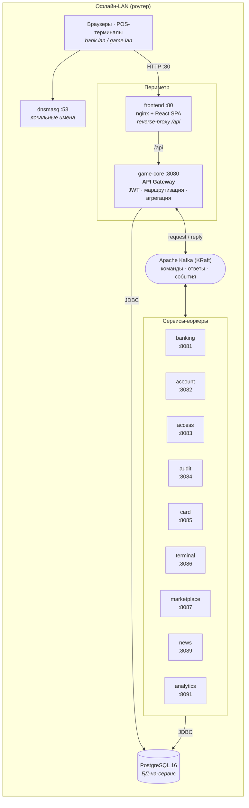
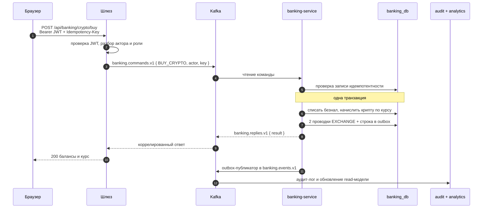

# Cyberpunk Economy

**Событийная микросервисная платформа, на которой прошла живая экономическая игра для ~70 участников — полностью офлайн, на обычных ноутбуках.**

[](https://github.com/Andrew97422/cyberpunk-economy/actions/workflows/ci.yml)
[](https://openjdk.org/projects/jdk/17/)
[](https://spring.io/projects/spring-boot)
[](https://kafka.apache.org/)
[](https://www.postgresql.org/)
[](https://react.dev/)
[](https://www.typescriptlang.org/)
[](LICENSE)

> 🇬🇧 [Read in English](README.md) · 📐 [Архитектура](docs/ARCHITECTURE.md) · 🔐 [Безопасность](docs/SECURITY.md) · 📬 [Каталог событий](main-server/docs/event-catalog.md)

---

## Что это

У игроков ролевой игры есть банковские счета, физические платёжные карты и POS-терминалы.
Они переводят деньги, торгуют криптовалютой с «живым» курсом, покупают товары в магазине
с расписанием ценовых сценариев и читают внутриигровую новостную ленту. Банкиры и админы
управляют экономикой из бэк-офиса; каждое действие попадает в аудит-лог и в аналитическую
read-модель.

Внутри — **событийный бэкенд из десяти сервисов на Spring Boot**: API-шлюз, который говорит
по HTTP с браузером и по **Kafka request/reply** с воркерами, изоляция «БД-на-сервис»,
транзакционный **outbox** для надёжной публикации событий и **ключи идемпотентности** на
каждой денежной операции.

Жёсткое ограничение, определившее все решения: **всё должно работать без интернета, на двух-трёх
обычных ноутбуках за туристическим роутером, руками не-инженеров.** Отсюда локальный DNS,
PowerShell-раннбуки, JVM с ограниченной кучей, скрипты переноса образов и печатный план
действий при сбоях.

Оно отработало: игра была полностью проведена ~70 участниками за два дня.

## Цифры

| | |
|---|---|
| **Сервисы бэкенда** | 10 приложений Spring Boot (шлюз + 9 воркеров) |
| **Java** | ~15 500 строк в 342 файлах |
| **Фронтенд** | SPA на React 18 + TypeScript, 35 страниц, ~7 700 строк |
| **REST API шлюза** | 86 эндпоинтов, OpenAPI/Swagger генерируется |
| **Kafka** | 19 топиков, 77 типизированных команд, request/reply + доменные события |
| **Хранение** | 10 баз, 49 JPA-сущностей, 36 таблиц, 28 миграций Flyway |
| **Интеграционные тесты** | 139 проверок в раннере без единой зависимости |
| **Развёртывание** | 3 топологии Compose (один хост / сплит на 3 машины), 15 контейнеров |

## Архитектура



### Жизненный цикл запроса — покупка криптовалюты



## Инженерные решения

**Kafka request/reply за REST-фасадом.**
`KafkaCommandGateway` превращает HTTP-вызов в коррелированную команду в топике сервиса и ждёт
ответ с таймаутом, транслируя ошибки воркеров обратно в честные HTTP-коды. Воркеры не выставляют
HTTP наружу — шлюз остаётся единственной входной дверью, поэтому SPA всегда same-origin, а
аутентификацию понимает ровно одно место.
→ [`KafkaCommandGateway.java`](main-server/src/main/java/ru/andrew/mainserver/gateway/core/KafkaCommandGateway.java)

**Транзакционный outbox вместо two-phase commit.**
Изменение состояния и его событие пишутся в одной транзакции БД; публикатор асинхронно
вычитывает `outbox_events` в Kafka. Никакого dual-write, потерянных событий и координатора
распределённых транзакций.
→ [`OutboxPublisher.java`](main-server/banking-service/src/main/java/ru/andrew/bankingservice/service/OutboxPublisher.java)

**Идемпотентность на каждой денежной команде.**
Ключ вместе с отпечатком запроса сохраняется до выполнения операции. Повтор запроса возвращает
сохранённый результат; *другой* payload под тем же ключом отклоняется. Ретраи на сетевом
периметре не могут списать деньги дважды.
→ [`IdempotencyService.java`](main-server/banking-service/src/main/java/ru/andrew/bankingservice/service/IdempotencyService.java)

**БД-на-сервис + репликация снапшотов.**
Каждый сервис владеет своей схемой, никто не читает чужие таблицы. Данные аккаунта, реально
нужные banking/access/card (`publicName`, роль, статус), реплицируются локально в
`account_snapshot` и поддерживаются в актуальном состоянии через подписку на события аккаунтов.
Консистентность в конечном счёте явная и ограниченная, а не спрятанная за join.

**Крипторынок как физический закон.**
Курс — дискретный стохастический процесс с возвратом к среднему, а не заскриптованная кривая:

```
logReturn = drift + k·ln(baseline / rate) + volatility·Z ,   Z ~ N(0,1)
rate'     = clamp(rate · e^logReturn, [min, max])
```

`drift` — направленное давление админа (pump/dump как *политический* рычаг), шок применяет
мгновенный множитель, а `k` тянет цену домой, чтобы рынок не убежал за многочасовую игру.
Каждый тик пишется в `crypto_tick` — именно поэтому графики торгов настоящие, а не декоративные.
→ [`CryptoMarketService.java`](main-server/banking-service/src/main/java/ru/andrew/bankingservice/service/CryptoMarketService.java)

**Схема как код.** Везде `ddl-auto: validate` — схему меняют только миграции Flyway, и сервис
откажется стартовать против базы, которую не узнаёт.

**Эксплуатация руками не-инженеров.** Раннбук из 13 документов в [`ИНСТРУКЦИЯ/`](ИНСТРУКЦИЯ/)
покрывает настройку сети, определение IP, перенос Docker-образов на офлайн-машину, действия при
сбоях и питание — плюс PowerShell-инструменты в [`deploy/balancer/`](deploy/balancer/) для
старта/health-check/бэкапа/восстановления/сброса и раскладки сервисов по ноутам с учётом ОЗУ.

## Стек

| Слой | Выбор |
|---|---|
| **Язык / рантайм** | Java 17, TypeScript 5.6, Node 18+ |
| **Бэкенд** | Spring Boot 3.5 — Web, Data JPA, Security, Validation, Actuator |
| **Обмен сообщениями** | Apache Kafka (KRaft, один брокер), `ReplyingKafkaTemplate` |
| **Хранение** | PostgreSQL 16, Hibernate, Flyway |
| **Аутентификация** | JWT (JJWT 0.12), BCrypt, `@PreAuthorize`, PIN-сессии для терминалов |
| **Документация API** | springdoc-openapi (Swagger UI в каждом сервисе) |
| **Фронтенд** | React 18, React Router 6, Vite 5, Axios, `marked` + DOMPurify |
| **Инфраструктура** | Docker Compose, nginx, dnsmasq, PowerShell-раннбуки |

## Быстрый старт

**Нужен:** Docker Desktop (или Docker Engine + Compose v2). Больше ничего — JVM и Node живут
внутри сборочных образов.

```bash
git clone https://github.com/Andrew97422/cyberpunk-economy.git
cd cyberpunk-economy

cp .env.example .env
# Впиши реальные значения — compose падает, если секрет не задан:
#   openssl rand -base64 48   -> APP_JWT_SECRET   (обязательно валидный Base64)
#   openssl rand -hex 24      -> DB_PASSWORD
#   openssl rand -hex 12      -> BOOTSTRAP_ADMIN_PASSWORD

docker compose up -d --build
```

| Что | Адрес |
|---|---|
| UI игры и банка | `http://localhost` |
| API шлюза | `http://localhost:8080/api` |
| Swagger UI | `http://localhost:8080/api/docs` |
| Health | `http://localhost:8080/api/actuator/health` |
| Kafka UI *(по профилю)* | `http://localhost:8090` |

Вход — `BOOTSTRAP_ADMIN_NAME` / `BOOTSTRAP_ADMIN_PASSWORD` из `.env`.
На Windows всё оборачивает `СТАРТ.cmd` для операторов на площадке.

**Мульти-машинный режим (3 ноутбука):** `.env.multi.example` и топологии
`compose.core.yaml` + `compose.finance.yaml` + `compose.rest.yaml`. См. [DEPLOY-MULTI.md](DEPLOY-MULTI.md).

## Тесты

```bash
# Интеграционный набор — 139 проверок против живого стека, без зависимостей
node e2e/seed.mjs            # опционально: демо-аккаунты, товары, новости
node e2e/run-scenarios.mjs   # BASE=... ADMIN_NAME=... ADMIN_PASSWORD=... для переопределения
```

Раннер гоняет авторизацию, аккаунты, PIN-коды, банкинг (в контексте админа и игрока), сессии и
аудит через настоящий шлюз, включая асинхронное распространение аккаунта в banking (повторяет
запрос, пока не приедет снапшот через Kafka). Ожидаемый код ответа для каждого случая описан в
[`e2e/SCENARIOS.md`](e2e/SCENARIOS.md).

> **Честный пробел:** юнит-покрытие на уровне JVM тонкое — гарантии корректности сегодня несёт
> набор выше. Юнит-тесты вокруг банковского домена — первый пункт [дорожной карты](#дорожная-карта).

## Структура репозитория

```
.
├── main-server/              # 10 Maven-проектов: шлюз + 9 сервисов-воркеров
│   ├── src/                  #   game-core — API-шлюз (JWT, маршрутизация, агрегация)
│   ├── banking-service/      #   балансы, реестр проводок, криптобиржа, кредиты, outbox
│   ├── account-service/      #   аккаунты, роли, статусы, бутстрап админа
│   ├── access-service/       #   PIN-коды и игровые сессии
│   ├── card-service/         #   привязка физических карт к аккаунтам
│   ├── terminal-service/     #   POS-терминалы
│   ├── marketplace-service/  #   товары, заказы, ценовые сценарии по расписанию
│   ├── news-service/         #   внутриигровая лента
│   ├── audit-service/        #   аудит-лог и «флешка бога»
│   ├── analytics-service/    #   read-модель поверх событий
│   └── docs/event-catalog.md #   версионированные контракты событий
├── frontend/                 # SPA на React 18 + TS (feature-sliced), образ nginx
├── e2e/                      # интеграционный раннер без зависимостей + каталог сценариев
├── deploy/                   # PowerShell-инструменты, инициализация Postgres, лимиты
├── docs/                     # архитектура, безопасность, дизайн-документ игры
├── ИНСТРУКЦИЯ/               # раннбук из 13 частей для операторов на площадке
├── docker-compose.yaml       # топология одного хоста
└── compose.{core,finance,rest}.yaml   # сплит на 3 машины
```

## Безопасность

Секреты живут только в `.env`, который в `.gitignore`; в Compose они объявлены как `${VAR:?}`,
поэтому стек **падает закрытым**, а не стартует на слабом дефолте. Аутентификация — JWT на шлюзе
с `@PreAuthorize` на эндпоинтах плюс отдельные PIN-сессии для терминалов.

Известный бэклог харднинга — закрыть порты сервисов, прикрыть Swagger/Actuator, секрет-менеджер,
TLS — открыто ведётся в [docs/SECURITY.md](docs/SECURITY.md).

Реальные игровые данные (имена участников, балансы, транзакции) **намеренно исключены** из
репозитория и закрыты в `.gitignore`.

## Известные ограничения

Это MVP, сделанный к дате, и он так и описан, а не приукрашен:

- **Единые точки отказа** — один Postgres, один брокер Kafka (RF=1). Failover между ноутбуками —
  документированная ручная процедура.
- **Сетевая поверхность** — порты воркеров и Postgres проброшены на хост: приемлемо в
  изолированной LAN и неверно для всего остального.
- **Наблюдаемость** — аудит, аналитика и метрики Actuator есть, централизованного сбора нет.
- **Юнит-покрытие** — см. [Тесты](#тесты).

## Дорожная карта

- **Фаза 0 — фундамент:** юнит-тесты банковского домена, реестр образов, секрет-менеджер,
  автоматизация бэкапа/восстановления, базовая наблюдаемость.
- **Фаза 1 — масштаб на событии:** Compose → **k3s** (самовосстановление, rolling-обновления,
  реплики stateless-сервисов), тёплый standby Postgres.
- **Фаза 2 — продукт:** облачный control-plane (тенанты, лицензии, телеметрия), edge-апплайанс
  с GitOps, мультиарендность.

Подробное обоснование — в [docs/ARCHITECTURE.md](docs/ARCHITECTURE.md).

## Лицензия

[MIT](LICENSE) © Андрей Носов
