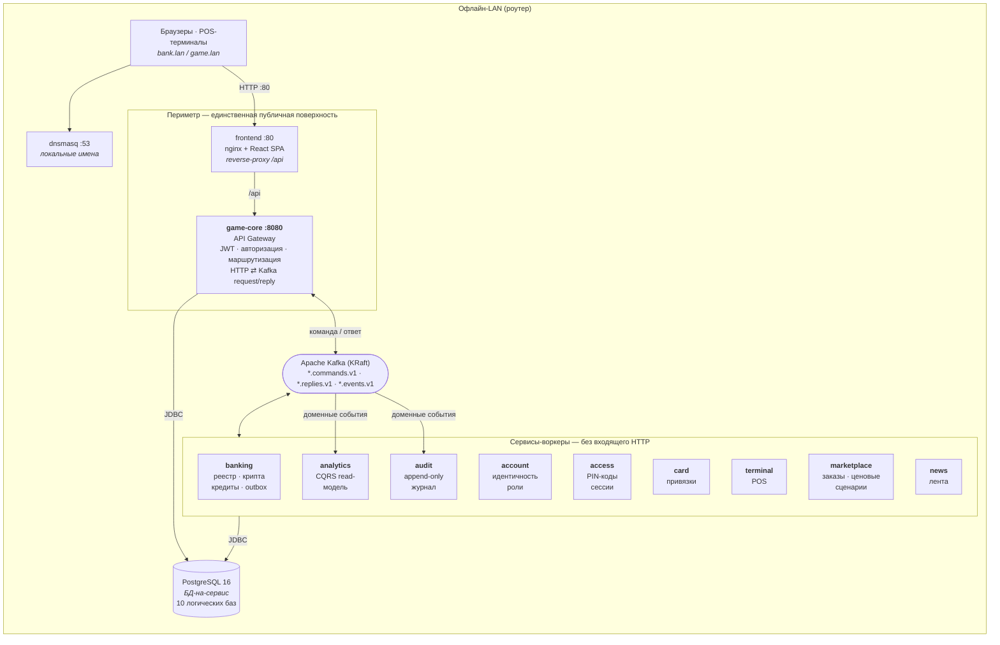
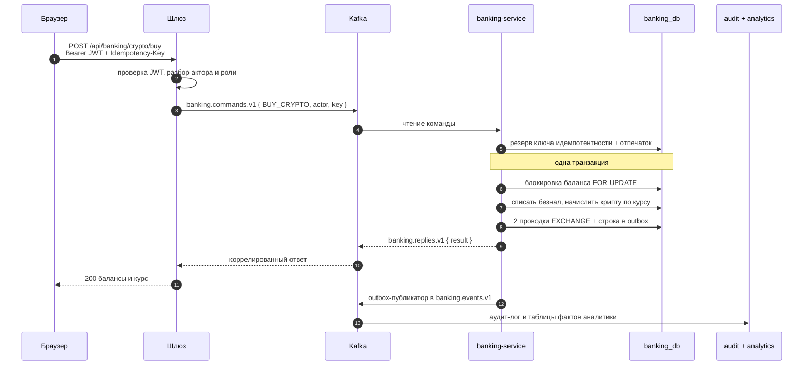

# Cyberpunk Economy

**Событийный бэкенд из десяти сервисов на Spring Boot, на котором прошла живая экономическая игра для ~70 участников: Kafka request/reply за API-шлюзом, БД-на-сервис, транзакционный outbox, идемпотентные денежные операции. Полностью офлайн, на обычных ноутбуках.**

[](https://github.com/Andrew97422/cyberpunk-economy/actions/workflows/ci.yml)
[](https://openjdk.org/projects/jdk/17/)
[](https://spring.io/projects/spring-boot)
[](https://kafka.apache.org/)
[](https://www.postgresql.org/)
[](https://flywaydb.org/)
[](https://docs.docker.com/compose/)
[](LICENSE)

> 🇬🇧 [Read in English](README.md) · 📐 [Архитектура](docs/ARCHITECTURE.md) · 🔐 [Безопасность](docs/SECURITY.md) · 📬 [Каталог событий](main-server/docs/event-catalog.md) · 🧪 [Каталог сценариев](e2e/SCENARIOS.md)

---

## Что это

Ролевой игре нужна работающая экономика: счета, физические платёжные карты, POS-терминалы,
криптовалюта с самостоятельно живущим курсом, центробанк с ключевой ставкой, магазин с ценовыми
сценариями по расписанию, новостная лента, аудит. Это система, которая всё это отработала.

Интересна не игра. Интересно, что **бэкенд должен был вести себя как платёжная система** — без
двойных списаний на ретрае, без потерянных событий, без порванных переводов при конкурентном
доступе — и при этом работать **без интернета, на двух-трёх обычных ноутбуках за туристическим
роутером, руками людей, которые не инженеры.**

Оно отработало: ~70 участников полностью сыграли за два дня.

## Цифры

| | |
|---|---|
| **Бэкенд** | 10 независимых сервисов Spring Boot · ~15 500 строк в 342 Java-файлах |
| **API-шлюз** | 86 REST-эндпоинтов, OpenAPI генерируется, единственный процесс, видимый клиентам |
| **Обмен сообщениями** | Apache Kafka (KRaft) · 26 топиков (9 пар команда/ответ + 8 потоков событий) · 78 типизированных команд |
| **Хранение** | 10 баз · 49 JPA-сущностей · 36 таблиц · 28 миграций Flyway · схема как код |
| **Консистентность** | Транзакционный outbox · ключи идемпотентности · упорядоченные пессимистичные блокировки · CQRS read-модель |
| **Интеграционные тесты** | 139 проверок против живого стека, без тестовых зависимостей |
| **Развёртывание** | 3 топологии Compose (один хост / сплит на 3 машины) · 15 контейнеров |
| **Фронтенд** | SPA на React 18 + TypeScript, 35 страниц (тонкий клиент над шлюзом) |

## Архитектура

Клиент общается ровно с **одним** процессом. Шлюз аутентифицирует, затем превращает HTTP в
коррелированные команды в Kafka; сервисы-воркеры наружу HTTP не выставляют.



### Сервисы и данные, которыми они владеют

Ни один сервис не читает таблицы другого. Никогда.

| Сервис | Порт | Владеет | Ключевая механика |
|---|---|---|---|
| **game-core** *(шлюз)* | 8080 | read-модели `accounts` и `session_snapshot`, `outbox_events` | JWT, `@PreAuthorize`, корреляция HTTP⇄Kafka, агрегация ответов |
| **banking** | 8081 | `balances`, `bank_transactions`, `crypto_market_state`, `crypto_tick`, `deposits`, `loans`, `credit_policy`, `idempotency_records`, `outbox_events` | Парные проводки с running balance, стохастический крипторынок, кредитная модель на ключевой ставке, идемпотентность, outbox |
| **account** | 8082 | `accounts` | Идентичность, роли, статусы, бутстрап админа, публикует `account.events` |
| **access** | 8083 | `pin_codes`, `game_sessions` | Выдача PIN-кодов и сессии терминалов |
| **audit** | 8084 | `audit_logs` | Append-only журнал событий, «флешка бога» |
| **card** | 8085 | `card_bindings` | Привязка физической карты к аккаунту |
| **terminal** | 8086 | `terminals` | Регистрация и маршрутизация POS |
| **marketplace** | 8087 | `products`, `market_orders`, `scenarios`, `scenario_schedules`, `pending_steps` | Долговечный планировщик ценовых сценариев на БД |
| **news** | 8089 | `news_posts` | Лента с загрузкой медиа |
| **analytics** | 8091 | `account_fact`, `money_flow`, `order_fact` | CQRS read-модель поверх доменных событий |

## Инженерия бэкенда

### Шлюз — единственная входная дверь

`KafkaCommandGateway` превращает аутентифицированный HTTP-вызов в коррелированную
`ServiceCommand` в топике команд сервиса и ждёт ответ в топике replies с таймаутом. Один
универсальный хелпер инстанцируется по разу на каждый нижележащий сервис — добавление сервиса
становится конфигурацией, а не кодом.

Тонкое место — **честность ошибок через асинхронную границу**. Воркер не может бросить HTTP-исключение
вызывающему, поэтому каждый слушатель команд ловит свои доменные исключения и кодирует нужный
статус в конверт ответа:

```java
try {
    reply = dispatch(command, type);
} catch (BadRequestException ex) {   reply = ServiceReply.error(400, ex.getMessage()); }
catch (NotFoundException ex)     {   reply = ServiceReply.error(404, ex.getMessage()); }
catch (Exception ex)             {   reply = ServiceReply.error(500, "Internal error: …"); }
```

Шлюз разворачивает это обратно в настоящий `ResponseStatusException`, так что клиент видит `400`
при нехватке средств и `404` при отсутствующем аккаунте — ровно как если бы вызов был синхронным.
Полная ожидаемая карта статусов зафиксирована в [`e2e/SCENARIOS.md`](e2e/SCENARIOS.md).

→ [`KafkaCommandGateway.java`](main-server/src/main/java/ru/andrew/mainserver/gateway/core/KafkaCommandGateway.java)
· [`BankingCommandListener.java`](main-server/banking-service/src/main/java/ru/andrew/bankingservice/listener/BankingCommandListener.java)

### Корректность денег

**Идемпотентность с отпечатком запроса.** Каждая денежная команда сохраняет
`(ключ, SHA-256(операция|actorId|payload))` *до* выполнения работы. Повтор с тем же ключом
возвращает сохранённый ответ; тот же ключ с *другим* payload отклоняется, а не молча делает не то.
Сетевые ретраи на периметре не могут списать деньги дважды.
→ [`IdempotencyService.java`](main-server/banking-service/src/main/java/ru/andrew/bankingservice/service/IdempotencyService.java)

**Реестр, а не колонка с балансом.** Каждая операция пишет парные проводки — `TRANSFER_OUT` и
`TRANSFER_IN`, или две строки `EXCHANGE` для крипто-сделки — и каждая несёт `balance_before` и
`balance_after` по своему счёту. Отклонённые попытки тоже сохраняются со статусом `REJECTED`:
попытка потратить больше, чем есть, оставляет след, а не исчезает. История любого счёта
восстанавливается по его же строкам, а сторнирование — это проводки (`REVERSAL_IN`/`REVERSAL_OUT`),
а не удаление; на практике реестр append-only.

**Переводы без дедлоков.** Перевод блокирует две строки. Брать блокировки в том порядке, в
котором пришли аккаунты, — это дедлок при первом же встречном платеже двух игроков, поэтому
порядок всегда детерминированный:

```java
Long firstId  = Math.min(from.getId(), to.getId());
Long secondId = Math.max(from.getId(), to.getId());

Balance firstLocked  = getBalanceForUpdate(firstId);   // SELECT … FOR UPDATE
Balance secondLocked = getBalanceForUpdate(secondId);
```

→ [`BankingServiceImpl.java`](main-server/banking-service/src/main/java/ru/andrew/bankingservice/service/BankingServiceImpl.java)
· [`BalanceRepository.java`](main-server/banking-service/src/main/java/ru/andrew/bankingservice/repository/BalanceRepository.java)

**Транзакционный outbox вместо two-phase commit.** Изменение состояния и его событие пишутся в
одной транзакции БД; публикатор вычитывает `outbox_events` каждые 3 с пачками, ключом берётся id
агрегата — порядок событий по аккаунту сохраняется внутри партиции. Ни dual-write, ни потерянных
событий, ни координатора распределённых транзакций.
→ [`OutboxPublisher.java`](main-server/banking-service/src/main/java/ru/andrew/bankingservice/service/OutboxPublisher.java)
· [`V3__create_outbox_events.sql`](main-server/banking-service/src/main/resources/db/migration/V3__create_outbox_events.sql)

**Продюсеры настроены на надёжность.** `acks=all` плюс `enable.idempotence=true` на каждом
продюсере — брокерный ретрай не может молча продублировать событие.
→ [`KafkaConfig.java`](main-server/banking-service/src/main/java/ru/andrew/bankingservice/config/KafkaConfig.java)

### Владение данными без распределённых join'ов

Каждый сервис владеет своей схемой. Поля идентичности, реально нужные banking, access и card —
`publicName`, роль, статус — реплицируются в локальную таблицу `account_snapshot`, актуальную за
счёт подписки на `account.events`. Консистентность в конечном счёте сделана **явной и
ограниченной**, а не спрятана за кросс-сервисным join'ом или синхронным вызовом на горячем пути.

Именно поэтому E2E-раннер повторяет первую банковскую операцию после создания аккаунта:
распространение действительно асинхронное, и набор тестов честен об этом, а не спит фиксированное
время.

Тот же приём даёт **отзываемую stateless-аутентификацию**. JWT сам по себе нельзя инвалидировать,
поэтому токен несёт id сессии, а шлюз держит read-модель `session_snapshot`, наполняемую из
`session.events` от access-service. `JwtAuthenticationFilter` проверяет статус сессии и её
абсолютный дедлайн по этой локальной таблице — банкир может убить сессию, и она умрёт на следующем
запросе, **без обращения в Kafka на горячем пути каждого вызова**.
→ [`JwtAuthenticationFilter.java`](main-server/src/main/java/ru/andrew/mainserver/auth/token/JwtAuthenticationFilter.java)
· [`SessionSyncListener.java`](main-server/src/main/java/ru/andrew/mainserver/session/sync/SessionSyncListener.java)

### Моделирование предметной области

**Крипторынок — физический закон, а не заскриптованная кривая.** Курс — дискретный стохастический
процесс с возвратом к среднему, продвигаемый по таймеру и сохраняемый тик за тиком:

```
logReturn = drift + κ·ln(baseline / rate) + volatility·Z ,   Z ~ N(0,1)
rate'     = clamp(rate · e^logReturn, [min, max])
```

`drift` — направленное давление админа, так что pump и dump становятся *политическим* рычагом, а
не захардкоженным событием; шок даёт мгновенный множитель; `κ` тянет цену домой, чтобы рынок не
убежал за многочасовую игру. Сохранение каждого тика в `crypto_tick` — то, что делает графики
торгов настоящими.
→ [`CryptoMarketService.java`](main-server/banking-service/src/main/java/ru/andrew/bankingservice/service/CryptoMarketService.java)

**Центробанк, а не фиксированный процент.** Админ задаёт ключевую ставку; ставка по вкладу —
`keyRate − depositSpread`, по займу — `keyRate + loanSpread`. Проценты капитализируются за каждый
прошедший период, и начисление **без дрейфа и устойчиво к простою**, что важно, когда ноутбук
закрыли посреди игры:

```java
int periods = elapsedPeriods(d.getLastAccruedAt(), now, periodSeconds);
d.setCurrentAmount(scale(d.getCurrentAmount().multiply(depFactor.pow(periods))));
d.setLastAccruedAt(d.getLastAccruedAt().plusSeconds((long) periods * periodSeconds));
```

Курсор сдвигается на целое число периодов, а не прыгает на `now`, — после простоя проценты не
теряются и не начисляются дважды, а «догон» ограничен сверху, чтобы не разнесло после долгого
отключения.
→ [`CreditService.java`](main-server/banking-service/src/main/java/ru/andrew/bankingservice/service/CreditService.java)

**Долговечный планировщик, а не таймер в памяти.** Ценовые сценарии магазина — это строки:
`scenario_schedules` с курсором `next_fire_at` и `pending_steps` для отложенных многошаговых
ценовых рамп, которые опрашиваются из БД. Рестарт посреди сценария продолжает ровно с места
остановки.
→ [`ScenarioSchedulerPoller.java`](main-server/marketplace-service/src/main/java/ru/andrew/marketplaceservice/service/ScenarioSchedulerPoller.java)

**CQRS read-модель.** `analytics-service` ничего не пишет в транзакционный путь. Он потребляет
доменные события и ведёт собственные таблицы фактов (`account_fact`, `money_flow`, `order_fact`),
поэтому отчётные запросы никогда не трогают и не блокируют реестр.
→ [`AnalyticsIngestionService.java`](main-server/analytics-service/src/main/java/ru/andrew/analyticsservice/service/AnalyticsIngestionService.java)

### Безопасность и дисциплина схемы

Deny-by-default на шлюзе: stateless-сессии, явный список `permitAll`, всё остальное —
аутентифицировано, плюс `@EnableMethodSecurity` для проверки ролей на эндпоинтах и отдельные
PIN-сессии для терминалов. Секреты существуют только в `.env`; в Compose они объявлены как
`${VAR:?}`, поэтому стек **падает закрытым**, а не стартует на слабом дефолте — это свойство
активно проверяется в CI попыткой запуститься с каждым снятым секретом.

Схемы меняются только через Flyway. Девять сервисов из десяти работают с `ddl-auto: validate` и
откажутся стартовать против базы, которую не узнают; исключение — `analytics-service`, чьи таблицы
фактов пока генерирует Hibernate (см. [ограничения](#известные-ограничения)).

### Куда смотреть в первую очередь

| Если хочется увидеть… | Читать |
|---|---|
| Границу HTTP⇄Kafka | [`KafkaCommandGateway.java`](main-server/src/main/java/ru/andrew/mainserver/gateway/core/KafkaCommandGateway.java) |
| Инварианты денег при конкурентности | [`BankingServiceImpl.java`](main-server/banking-service/src/main/java/ru/andrew/bankingservice/service/BankingServiceImpl.java) |
| Семантику exactly-once на периметре | [`IdempotencyService.java`](main-server/banking-service/src/main/java/ru/andrew/bankingservice/service/IdempotencyService.java) |
| Надёжную публикацию событий | [`OutboxPublisher.java`](main-server/banking-service/src/main/java/ru/andrew/bankingservice/service/OutboxPublisher.java) |
| Нетривиальную доменную математику | [`CryptoMarketService.java`](main-server/banking-service/src/main/java/ru/andrew/bankingservice/service/CryptoMarketService.java) · [`CreditService.java`](main-server/banking-service/src/main/java/ru/andrew/bankingservice/service/CreditService.java) |
| Контракты событий | [`main-server/docs/event-catalog.md`](main-server/docs/event-catalog.md) |
| Ожидаемое поведение API | [`e2e/SCENARIOS.md`](e2e/SCENARIOS.md) |

## Жизненный цикл запроса — покупка криптовалюты



## Фронтенд

Намеренно тонкая SPA на React 18 + TypeScript (35 страниц, feature-sliced) под nginx, который
заодно проксирует `/api`, так что приложение всегда same-origin. Бизнес-правил в нём нет: любой
баланс, цена и решение о доступе приходят из бэкенда. Markdown в новостях рендерится через `marked`
и санитизируется DOMPurify.

## Быстрый старт

**Нужен:** Docker Desktop (или Docker Engine + Compose v2). Больше ничего — JVM и Node живут внутри
сборочных образов.

```bash
git clone https://github.com/Andrew97422/cyberpunk-economy.git
cd cyberpunk-economy

cp .env.example .env
# Впиши реальные значения — compose падает, если секрет не задан:
#   openssl rand -base64 48   -> APP_JWT_SECRET   (обязательно валидный Base64)
#   openssl rand -hex 24      -> DB_PASSWORD
#   openssl rand -hex 12      -> BOOTSTRAP_ADMIN_PASSWORD

docker compose up -d --build
```

| Что | Адрес |
|---|---|
| UI игры и банка | `http://localhost` |
| API шлюза | `http://localhost:8080/api` |
| Swagger UI | `http://localhost:8080/api/docs` |
| Health | `http://localhost:8080/api/actuator/health` |
| Kafka UI *(по профилю)* | `http://localhost:8090` |

Вход — `BOOTSTRAP_ADMIN_NAME` / `BOOTSTRAP_ADMIN_PASSWORD` из `.env`.
На Windows всё оборачивает `СТАРТ.cmd` для операторов на площадке.

**Собрать бэкенд напрямую:**

```bash
cd main-server
./mvnw -B -DskipTests package                          # шлюз
./mvnw -B -DskipTests -f banking-service/pom.xml package
```

**Мульти-машинный режим (3 ноутбука):** `.env.multi.example` и топологии
`compose.core.yaml` + `compose.finance.yaml` + `compose.rest.yaml`. См. [DEPLOY-MULTI.md](DEPLOY-MULTI.md).

## Тесты

```bash
node e2e/run-scenarios.mjs   # против поднятого стека — это вся команда
node e2e/seed.mjs            # опционально: демо-аккаунты, товары, новости
```

Учётные данные берутся из того же `.env`, с которым поднят стек, — экспортировать ничего не нужно;
`BASE`, `ADMIN_NAME` и `ADMIN_PASSWORD` переопределяют их, если целишься в другой хост. Код
возврата `0` при чистом прогоне, `1` если хоть один сценарий упал.

**139 проверок в 14 группах** через настоящий шлюз — health, авторизация (админ, игрок, логаут),
аккаунты, PIN-коды, сессии, банкинг в контексте админа и игрока, самообслуживание игрока, карты,
терминалы, магазин, новости и аудит. В том числе асинхронное распространение account→banking,
которое раннер повторяет, пока не приедет снапшот через Kafka, а не спит фиксированное время.
Ожидаемый код ответа для каждого случая описан в [`e2e/SCENARIOS.md`](e2e/SCENARIOS.md).

CI параллельно собирает все 10 Maven-проектов, проверяет типы и собирает SPA, валидирует каждую
топологию Compose и убеждается, что секреты по-прежнему падают закрытыми. Полный прогон E2E — в
отдельном workflow по кнопке.

> **Честный пробел:** юнит-покрытие на уровне JVM тонкое — гарантии корректности сегодня несёт
> набор выше. Юнит-тесты вокруг банковского домена — первый пункт
> [дорожной карты](#дорожная-карта).

## Структура репозитория

```
.
├── main-server/              # 10 независимых Maven-проектов
│   ├── src/                  #   game-core — API-шлюз (JWT, маршрутизация, агрегация)
│   ├── banking-service/      #   реестр, криптобиржа, кредиты, идемпотентность, outbox
│   ├── account-service/      #   аккаунты, роли, статусы, бутстрап админа
│   ├── access-service/       #   PIN-коды и игровые сессии
│   ├── card-service/         #   привязка физических карт к аккаунтам
│   ├── terminal-service/     #   POS-терминалы
│   ├── marketplace-service/  #   товары, заказы, долговечный планировщик цен
│   ├── news-service/         #   внутриигровая лента
│   ├── audit-service/        #   append-only аудит-лог
│   ├── analytics-service/    #   CQRS read-модель поверх доменных событий
│   └── docs/event-catalog.md #   версионированные контракты событий
├── frontend/                 # SPA на React 18 + TS, образ nginx
├── e2e/                      # интеграционный раннер без зависимостей + каталог сценариев
├── deploy/                   # PowerShell-инструменты, инициализация Postgres, лимиты
├── docs/                     # архитектура, безопасность, дизайн-документ игры
├── ИНСТРУКЦИЯ/               # раннбук из 13 частей для операторов на площадке
├── docker-compose.yaml       # топология одного хоста
└── compose.{core,finance,rest}.yaml   # сплит на 3 машины
```

## Эксплуатация

Раз система работает на площадке без инженера рядом, эксплуатационная поверхность — часть продукта:
раннбук из 13 документов в [`ИНСТРУКЦИЯ/`](ИНСТРУКЦИЯ/) про настройку сети, определение IP, перенос
Docker-образов на офлайн-машину, действия при сбоях и питание, плюс PowerShell-инструменты в
[`deploy/balancer/`](deploy/balancer/) для старта, health-check, бэкапа, восстановления, сброса,
экспорта/импорта образов и раскладки групп сервисов по ноутам с учётом ОЗУ. Кучи JVM ограничены
128–192 МБ, чтобы весь стек помещался на скромном железе.

## Известные ограничения

MVP, сделанный к дате, и описан он как MVP, а не приукрашен:

- **Единые точки отказа** — один инстанс Postgres, один брокер Kafka, топики с RF=1 и одной
  партицией. Failover между ноутбуками — документированная ручная процедура.
- **Нет параллелизма потребителей** — однопартиционные топики ограничивают группу одним активным
  консьюмером. Нормально для ~70 игроков, неверно для реального масштаба.
- **У outbox нет ретрая** — неудачная публикация помечается `FAILED` и остаётся оператору; ни
  backoff, ни dead-letter пока нет.
- **Один сервис нарушает правило схемы** — `analytics-service` до сих пор на `ddl-auto: update` без
  Flyway. Допустимо для производной read-модели, восстановимой из событий, но это несогласованность,
  а не осознанное решение.
- **Нет дедупликации на стороне потребителя** — доставка at-least-once, консьюмеры не идемпотентны.
  Таблица `processed_events` заведена миграцией как inbox, но не подключена; идемпотентность
  продюсера и ключи операций закрывают денежный путь, а не проекции.
- **Сплит-топология неполная** — `analytics-service` есть только в однохостовом Compose,
  поэтому развёртывание на 3 машины работает без read-модели.
- **Сетевая поверхность** — порты воркеров и Postgres проброшены на хост: приемлемо в изолированной
  LAN и неверно где-либо ещё.
- **Наблюдаемость** — аудит, аналитика и метрики Actuator есть, централизованного сбора логов и
  метрик нет.
- **Юнит-покрытие** — см. [Тесты](#тесты).

## Дорожная карта

- **Фаза 0 — фундамент:** юнит-тесты банковского домена, ретрай outbox с backoff и dead-letter
  топиком, реестр образов, секрет-менеджер, автоматизация бэкапа/восстановления, базовая
  наблюдаемость.
- **Фаза 1 — масштаб на событии:** Compose → **k3s** (самовосстановление, rolling-обновления,
  реплики stateless-сервисов), партиционированные топики для реального параллелизма консьюмеров,
  тёплый standby Postgres.
- **Фаза 2 — продукт:** облачный control-plane (тенанты, лицензии, телеметрия), edge-апплайанс
  с GitOps, мультиарендность.

Подробное обоснование — в [docs/ARCHITECTURE.md](docs/ARCHITECTURE.md).

## Лицензия

[MIT](LICENSE) © Андрей Носов
